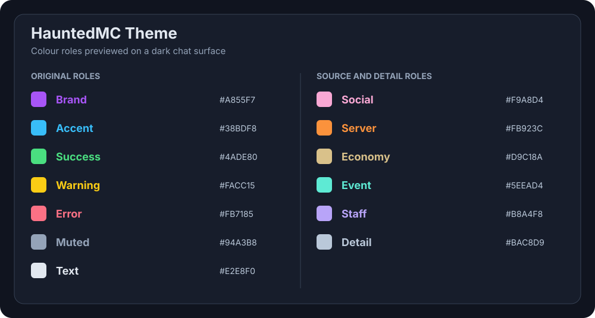
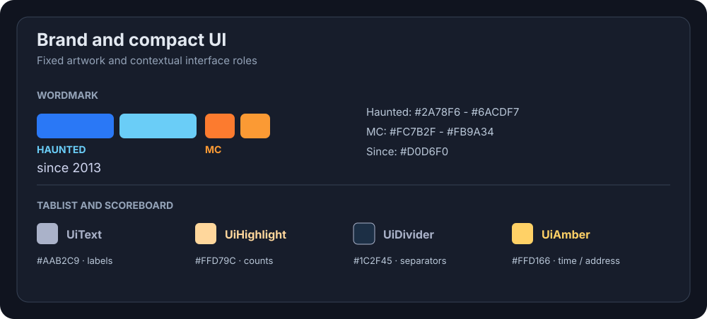

# HauntedMC colour contract





The theme has two independent signals: **where a message comes from** and **what happened**. Source colours identify a message at a glance; state colours mark its outcome or urgency. A readable message also names its source. Colour is a cue, not the only way to recognize it.

## Roles

| Role | Items | Use |
|---|---|---|
| Identity | `Brand` | General HauntedMC identity and account panels. The fixed wordmark has its own gradients. Avoid a Brand prefix on every feature message. |
| Source | `Social`, `Server`, `Economy`, `Event`, `Staff` | A short named prefix, icon, or key subject. Keep the rest of the sentence readable. |
| Network and action | `Accent` | Network routing notices, links, buttons, selected controls, and general interactive highlights. Name network messages because controls share this hue. |
| State | `Success`, `Warning`, `Error` | Outcome, priority marker, or a short state phrase. They do not replace the source colour. |
| Reading hierarchy | `Text`, `Detail`, `Muted` | Main sentence, useful secondary value, and quiet metadata or separators, respectively. |
| Brand signature | `WordmarkHaunted`, `WordmarkMc`, `BrandSince` | The fixed two-part HauntedMC mark and “since 2013” signature. The wordmark gradients have four named endpoint colors for direct Adventure use. |
| Compact UI | `UiText`, `UiHighlight`, `UiDivider`, `UiAmber` | Tablist and scoreboard labels, counts, separators, and focused metadata. |

Choose the most specific source represented in the message. A friend request is Social even when delivered through the network inbox. A payment is Economy even when addressed to one player. An event invite is Event even when delivered by the proxy. “Personal” describes the audience, so it does not override the source. For account or preference messages without a more specific source, use a Brand title or icon.

`Server` identifies local backend or gameplay notices, such as a grave expiry or local restart. `Accent` identifies network-wide routing, queue, or delivery notices. `Staff` identifies staff communication and moderation; a player-facing ban or kick may also use `Error` for the state. `Event` is for community participation, while a general network announcement uses `Accent` or `Brand` according to its sender.

## Message anatomy

Use one short coloured prefix with a word or recognizable icon, followed by `Text`. Put timestamps, separators, and low-priority context in `Muted`. Use `Detail` when a secondary value needs to remain easy to read. Highlight an actionable control with `Accent`. Use bold or layout sparingly to strengthen a heading; avoid using many bright colours within one sentence.

These MiniMessage examples show colour placement. They are examples for future consumer migrations; this Theme release does not rewrite existing feature messages.

```text
<HauntedMC:Social>✦ Vrienden <HauntedMC:Muted>· <HauntedMC:Error>Verzoek mislukt. <HauntedMC:Text>Probeer het later opnieuw.
<HauntedMC:Accent>◆ Netwerk <HauntedMC:Muted>· <HauntedMC:Warning>Omgeleid <HauntedMC:Text>naar <HauntedMC:Detail>{server}<HauntedMC:Text>.
<HauntedMC:Server>◆ Server <HauntedMC:Muted>· <HauntedMC:Text>Je graf verloopt over <HauntedMC:Detail>{remaining}<HauntedMC:Text>.
<HauntedMC:Economy>◆ Economie <HauntedMC:Muted>· <HauntedMC:Text>Je ontving <HauntedMC:Economy>{amount} <HauntedMC:Text>van {player}. <HauntedMC:Success>✓
<HauntedMC:Event>✦ Evenement <HauntedMC:Muted>· <HauntedMC:Text>Je bent uitgenodigd voor <HauntedMC:Detail>{title}<HauntedMC:Text>. <HauntedMC:Accent>[Bekijk]
<HauntedMC:Staff>◆ Staff <HauntedMC:Muted>· <HauntedMC:Text>{player} kreeg een waarschuwing. <HauntedMC:Warning>!
```

For a list or panel, use the full wordmark for a branded title or `Brand` for general identity, the source colour for its section title, `Text` for row labels, `Detail` for important values, and `Muted` for pagination or timestamps. Use `Success` and `Error` for actual states, such as enabled/disabled, rather than as colours for every row in a list.

## Wordmark and compact UI

The two wordmark gradients are fixed brand artwork: `WordmarkHaunted` runs from `#2A78F6` to `#6ACDF7`, and `WordmarkMc` runs from `#FC7B2F` to `#FB9A34`. Use the complete `HauntedMcBranding.THEME_WORDMARK` fragment in FeatureFramework localization or `HauntedMcBranding.MINIMESSAGE_WORDMARK` with standard MiniMessage. Both preserve the exact small-cap lettering and bold treatment. `HauntedMcBranding.THEME_SINCE` and `MINIMESSAGE_SINCE` preserve the exact stylized signature in `BrandSince` (`#D0D6F0`). The gradient endpoint items are also available as solid colors when building Adventure components directly; reserve them for the mark rather than treating them as new generic accent colors.

For tablists and scoreboards, `UiText` (`#AAB2C9`) carries subdued labels such as server name and player-count context. `UiHighlight` (`#FFD79C`) picks out a count or small icon. `UiDivider` (`#1C2F45`) is a dark separator, never body text. `UiAmber` (`#FFD166`) is for time and the server address where those need stronger emphasis. These roles keep the supplied deployed UI colors available without moving their duties into ordinary chat messages. `Text`, `Detail`, and `Muted` remain the reading hierarchy for normal messages.

For example, a tablist footer can use `<HauntedMC:UiText>ᴇʀ ᴢɪᴊɴ <HauntedMC:UiHighlight>%playercount_network_visible% <HauntedMC:UiText>ʜᴀᴜɴᴛɪᴇѕ ᴏɴʟɪɴᴇ`. A separator can use `<HauntedMC:UiDivider>|`, while a scoreboard time or address can use `<HauntedMC:UiAmber>`. These examples describe the Theme items for a future consumer migration; they do not alter ProxyFeatures or ServerFeatures.

## Adopting the contract

Feature defaults in ProxyFeatures and ServerFeatures are often embedded in Java `MessageMap` entries, while DataRegistry builds Adventure components directly. Migrate each visible message based on its source and purpose. Do not replace every existing `Accent`, legacy colour code, or severity tag mechanically. Existing custom/localized messages stay under the consumer's control.

Both artifacts expose the same values: `HauntedMcColor.SOCIAL.textColor()` in direct Adventure code and `<HauntedMC:Social>` through the FeatureFramework theme. All existing values and identifiers are unchanged.
